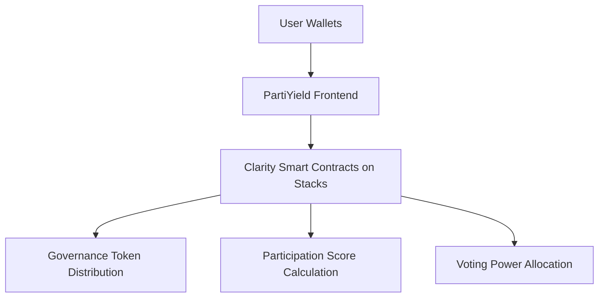

# 🗳️ PartiYield

**PartiYield** is a decentralized governance protocol built on the **Stacks** blockchain using **Clarity smart contracts**. It rewards active participation in a Web3 ecosystem by converting meaningful contributions into **governance influence** and **voting power**.

---

## 🌐 Overview

Governance systems often struggle with passive token holders and a lack of diverse voices. PartiYield addresses this by **incentivizing participation** through a fair, on-chain scoring mechanism that transforms community engagement into **yielded governance power**.

---

## 🔧 Features

| Feature                     | Description                                                                                                |
| --------------------------- | ---------------------------------------------------------------------------------------------------------- |
| 🏆 Contribution-Based Yield | Participants earn governance tokens based on their activity in the ecosystem.                              |
| ⛓️ Built on Stacks          | Fully decentralized and secured by Bitcoin via Stacks’ proof-of-transfer (PoX).                            |
| 📈 Participation Score      | Activity is scored on-chain using customizable metrics (voting, proposals, commits, forum activity, etc.). |
| ⚖️ Dynamic Voting Power     | Governance power is algorithmically tied to the participant’s recent contributions.                        |
| 🕒 Time-Decay Weighting     | Voting power decays without active participation, encouraging continuous engagement.                       |
| 📊 Fully On-Chain           | Participation and rewards are stored on-chain, ensuring transparency and verifiability.                    |

---

## ⚙️ Architecture



---

## 📜 Smart Contract Structure (Clarity)

### Key Contracts

| Contract                | Purpose                                                      |
| ----------------------- | ------------------------------------------------------------ |
| `partiyield-core.clar`  | Core logic for score tracking, rewards, and user interaction |
| `partiyield-token.clar` | Fungible token contract for governance power                 |
| `governance.clar`       | Proposal creation, voting, and quorum logic                  |

### Example: Participation Scoring Function

```clarity
(define-public (record-participation (user principal) (action-type uint))
  (begin
    ;; Increase user's participation score
    (map-set participation-scores
             {user: user}
             {score: (+ (get score (default-to {score: u0} (map-get? participation-scores {user: user}))) action-type)})
    (ok true)
  )
)
```

---

## 🚀 Getting Started

### Prerequisites

* [Clarity tools](https://docs.stacks.co/write-smart-contracts/clarity-tools)
* [Clarinet](https://github.com/hirosystems/clarinet) for local development and testing
* [Stacks Wallet](https://www.hiro.so/wallet)

### Clone & Setup

```bash
git clone https://github.com/your-org/partiyield.git
cd partiyield
clarinet check
clarinet test
```

### Deploy to Testnet

```bash
clarinet deploy
```

---

## 📄 Configuration

Participation types and their weights can be customized. For example:

```clarity
(define-constant VOTE_WEIGHT u10)
(define-constant PROPOSAL_WEIGHT u20)
(define-constant FORUM_WEIGHT u5)
```

These constants are referenced in the participation logging logic to adjust scores accordingly.

---

## 👥 Governance Flow

1. **Participate** in the ecosystem (vote, submit proposals, contribute to forums or GitHub).
2. **Earn score** recorded on-chain via `record-participation`.
3. **Claim yield** (governance tokens) periodically based on your score.
4. **Vote** on governance proposals with dynamically calculated voting power.

---

## 🧪 Testing

```bash
clarinet test
```

Add custom test cases in `tests/partiyield_test.ts` to simulate real participation scenarios and ensure fairness of reward distribution.

---

## 🛡 Security Considerations

* Permissioned access to participation score logging (integrators only)
* Rate-limiting or spam protection
* Use of time-decay functions to avoid long-term gaming of the system

---

## 🧩 Integrations

PartiYield can be connected with:

* Community discussion forums (e.g., [Stacks Forum](https://forum.stacks.org))
* DAO tools and dashboards
* GitHub activity bots for open-source contribution tracking

---

## 📬 Contributing

We welcome contributions from the community! Please:

1. Fork the repo
2. Create a feature branch
3. Submit a pull request

---

## 📄 License

MIT License © 2025 PartiYield Contributors
